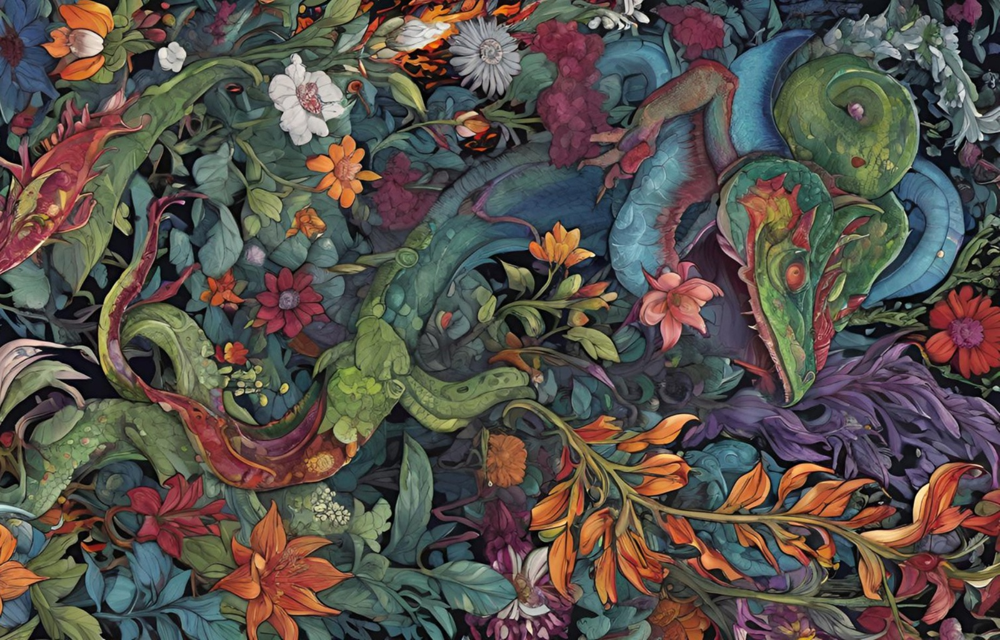

# PsycheView - Interactive Psychedelic Image Viewer

## UX SPECIFICATION

### Visual Design & Aesthetic
Create a super slick, modern, interactive web viewer with a **psychedelic, trippy vibe** featuring:
- **Glassmorphism effects** throughout the interface
- **Floating, animated background** that fills the entire page with psychedelic colors
- **Drop shadows and modern UI elements** with a professional finish
- **Tropical/psychedelic color scheme** with vibrant gradients
- **Smooth animations and transitions** for all interactions

### Core Layout Structure
1. **Full-page animated background** - psychedelic colors that animate continuously
2. **Central image window** - a clipped viewing area that acts as a "window" into the content
3. **Control panel** - floating glassmorphism panel with all interactive controls
4. **Debug console** - real-time feedback area for system status

### Image Window Behavior
The central viewing area should:
- **Size itself to fit the loaded image** with proper aspect ratio maintenance
- **Clip all content** at the window edges (no overflow visible)
- **Center the original image** within the window on load
- **Maintain consistent aspect ratio** matching the source image
- **Act as a viewport** into a larger infinite canvas

### Content Layers (All Move Together)
The image window contains 3 stacked layers that pan/zoom as one unit:
1. **Background pattern** - subtle, infinite tiling Islamic-inspired geometric pattern
2. **Grid overlay** - grey lines forming a grid with spacing based on image dimensions
3. **Image content** - the main image plus generated outfill blocks

### Navigation & Interaction
- **Click and drag** to pan all content smoothly
- **Mouse wheel** to zoom in/out (0.25x to 4x range)
- **Zoom centers on cursor position** for intuitive navigation
- **Smooth, fluid animations** for all movements
- **Touch support** for mobile devices

### Grid System
- **Horizontal grid lines** spaced at 1/4 of image height
- **Vertical grid lines** spaced at 1/4 of image width  
- **Grid extends infinitely** but clips at window edges
- **Grid moves with all other content** during pan/zoom

### Outfill Generation System
When empty grid areas become visible:
- **Loading indicators** appear in empty blocks (round progress spinners)
- **Asynchronous generation** with max 2 concurrent requests
- **Queue management** for orderly processing
- **Generated blocks** seamlessly integrate into the grid
- **Only adjacent blocks** to existing content are generated (no isolated islands)

### Control Interface
Floating glassmorphism panel containing:
- **API key management** with secure input
- **Mode toggles** (Live/Demo, Auto-generation on/off)
- **Debug controls** and system status
- **Block size options** (1x1, 2x2, 4x4, 8x8 grid divisions)
- **Manual testing buttons** for development

### Responsive Design
- **Mobile-friendly** touch interactions
- **Adaptive layouts** for different screen sizes
- **Consistent performance** across devices

---

## TECHNICAL IMPLEMENTATION DETAILS

### Repository Structure
```
psycheview/
├── index.html (standalone file, ~2400 lines)
├── psychedelic-flora.jpg (1600x1024px, main image)
└── psychedelic-bg.jpg (background pattern)
```

### Core Architecture
**Single HTML file** containing embedded CSS and JavaScript with modular class-based structure:

#### Main Class: `ImageViewer`
```javascript
class ImageViewer {
    constructor() {
        // Core viewport properties
        this.scale = 1.0;
        this.translateX = 0;
        this.translateY = 0;
        this.containerWidth = 0;
        this.containerHeight = 0;
        this.imageWidth = 0;
        this.imageHeight = 0;
        
        // Interaction state
        this.isDragging = false;
        this.lastMouseX = 0;
        this.lastMouseY = 0;
        
        // Grid and outfill system
        this.blockDivisions = 1; // Creates 1x1 blocks by default
        this.outfillBlocks = new Map();
        this.generationQueue = [];
        this.activeGenerations = 0;
        this.maxConcurrentGenerations = 2;
        this.lastVisibleBlocks = new Set();
        
        // API configuration
        this.apiKey = 'sk-khSJsDL...'; // Pre-configured Stability AI key
        this.isLiveMode = true;
        this.autoGenerateBlocks = true;
    }
}
```

### HTML Structure
```html
<div class="viewer-container">
    <div class="image-viewer" id="imageViewer">
        <div class="viewer-content" id="viewerContent">
            <div class="background-pattern"></div>
            <div class="grid-overlay" id="gridOverlay"></div>
            
            <div class="outfill-container" id="outfillContainer"></div>
        </div>
    </div>
</div>
```

### CSS Key Features
- **Glassmorphism**: `backdrop-filter: blur(10px)` with semi-transparent backgrounds
- **Animated background**: CSS keyframes creating flowing color gradients
- **Clipping**: `overflow: hidden` on viewer container
- **Transform-based movement**: `transform: translate() scale()` for smooth performance
- **Grid rendering**: Dynamically generated SVG grid overlay

### Core Methods

#### Initialization
```javascript
init() {
    // Sets up image loading with fallback dimensions
    // Configures event listeners for mouse/touch
    // Initializes API key from environment or uses fallback
    // Sets up grid system based on image dimensions
}
```

#### Transform System
```javascript
updateTransform() {
    this.content.style.transform = `translate(${this.translateX}px, ${this.translateY}px) scale(${this.scale})`;
    this.checkVisibleBlocks(); // Triggers outfill detection
}
```

#### Outfill Detection
```javascript
checkVisibleBlocks() {
    // Calculates viewport bounds in content space
    // Determines which grid blocks are visible
    // Identifies new blocks adjacent to existing content
    // Queues generation for new adjacent blocks only
}
```

#### API Integration
```javascript
async generateOutfill(blockKey) {
    // Creates FormData with image and mask
    // Calls Stability AI outpaint API
    // Handles response and displays generated content
    // Updates block status and progress indicators
}
```

### Grid System Implementation
- **Block size calculation**: `blockSizeX = imageWidth / blockDivisions`
- **Coordinate mapping**: Block keys like "1,0" map to pixel positions
- **Adjacency detection**: Checks 4-directional neighbors for content
- **Dynamic grid rendering**: SVG lines positioned based on current block size

### API Configuration
- **Stability AI Outpaint API**: `https://api.stability.ai/v2beta/stable-image/edit/outpaint`
- **Pre-configured API key**: Embedded in code for immediate functionality
- **FormData structure**: 
  - `image`: Original image as JPEG blob
  - `mask`: Generated PNG mask for target block
  - `output_format`: "jpeg"

### Event Handling
- **Mouse events**: mousedown, mousemove, mouseup for panning
- **Wheel events**: Zoom with cursor-centered scaling
- **Touch events**: Mobile support with touch handling
- **Keyboard events**: Various debug and control shortcuts

### State Management
- **Persistent transforms**: All content moves as single unit
- **Block tracking**: Map-based storage of outfill block states
- **Queue system**: FIFO processing with concurrency limits
- **Debug logging**: Comprehensive console output for development

### Performance Optimizations
- **Transform-based rendering**: Hardware-accelerated CSS transforms
- **Efficient block detection**: Only checks visible viewport area
- **Lazy generation**: Only creates blocks when they become visible
- **Adjacency filtering**: Prevents isolated block generation

### Error Handling
- **CORS fallback**: Handles file:// protocol limitations
- **API error recovery**: Graceful degradation when API fails
- **Image loading fallback**: Uses known dimensions when image fails to load
- **Network resilience**: Retry logic for failed API calls

---

## POTENTIAL IMPROVEMENTS

1. **Caching System**: Store generated blocks in localStorage for persistence
2. **Batch API Calls**: Combine multiple adjacent blocks into single API request
3. **Progressive Loading**: Stream large generated images progressively
4. **Undo/Redo**: Allow users to revert unwanted generations
5. **Export Functionality**: Save the complete expanded image
6. **Custom Prompts**: Allow users to specify generation prompts per block
7. **Performance Metrics**: Add timing and bandwidth monitoring
8. **Keyboard Shortcuts**: Full keyboard navigation support